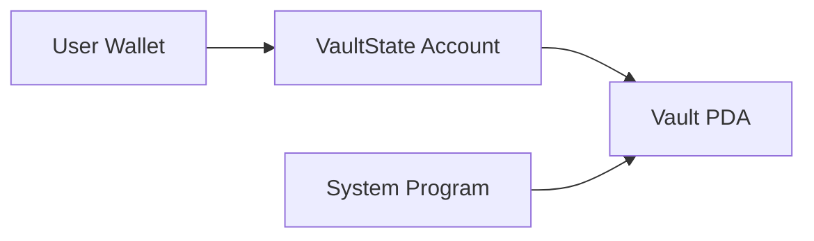

# Vault Program

The `vault` program is a Solana-based smart contract written using the Anchor framework. It provides functionality for initializing a vault, depositing funds, withdrawing funds, and closing the vault.

## Table of Contents

- [Vault Program](#vault-program)
  - [Table of Contents](#table-of-contents)
  - [Overview](#overview)
  - [Instructions](#instructions)
    - [Initialize](#initialize)
    - [Deposit](#deposit)
    - [Withdraw](#withdraw)
    - [Close](#close)
  - [Installation](#installation)
    - [Prerequisites](#prerequisites)
    - [Setup](#setup)
  - [Usage](#usage)
    - [Initialize Vault](#initialize-vault)
    - [Deposit SOL](#deposit-sol)
    - [Withdraw SOL](#withdraw-sol)
    - [Close Vault](#close-vault)
  - [Technical Design](#technical-design)
    - [Account Structure](#account-structure)
    - [Key Components](#key-components)
  - [Security Considerations](#security-considerations)
    - [Critical Safeguards](#critical-safeguards)

---

## Overview

The `vault` program is designed to manage funds in a secure and efficient manner. It allows users to:
- Initialize a vault account.
- Deposit funds into the vault.
- Withdraw funds from the vault.
- Close the vault when it is no longer needed.

This program is built using the [Anchor framework](https://www.anchor-lang.com/), which simplifies Solana smart contract development.

---

## Instructions

### Initialize

**Function:** `initialize(ctx: Context<Initialize>) -> Result<()>`

This instruction initializes the vault account. It sets up the necessary state and prepares the vault for deposits and withdrawals.

### Deposit

**Function:** `deposit(ctx: Context<Payment>, amount: u64) -> Result<()>`

This instruction allows a user to deposit a specified amount of funds into the vault.

- **Parameters:**
  - `ctx`: The context containing the accounts required for the deposit.
  - `amount`: The amount of funds to deposit.

### Withdraw

**Function:** `withdraw(ctx: Context<Payment>, amount: u64) -> Result<()>`

This instruction allows a user to withdraw a specified amount of funds from the vault.

- **Parameters:**
  - `ctx`: The context containing the accounts required for the withdrawal.
  - `amount`: The amount of funds to withdraw.

### Close

**Function:** `close(ctx: Context<Close>) -> Result<()>`

This instruction closes the vault. It is typically used when the vault is no longer needed.

---

## Installation

### Prerequisites

- Rust and Cargo installed. ([Install Rust](https://www.rust-lang.org/tools/install))
- Solana CLI installed. ([Install Solana CLI](https://docs.solana.com/cli/install-solana-cli-tools))
- Anchor framework installed. ([Install Anchor](https://www.anchor-lang.com/docs/installation))

### Setup
```bash
git clone https://github.com/your-username/solana-vault-program.git
cd solana-vault-program
anchor build

```

## Usage

### Initialize Vault
```typescript
const [vaultStatePDA] = anchor.web3.PublicKey.findProgramAddressSync(
  [Buffer.from("state"), user.publicKey.toBuffer()],
  program.programId
);

await program.methods.initialize()
  .accounts({
    user: user.publicKey,
    vaultState: vaultStatePDA,
    systemProgram: anchor.web3.SystemProgram.programId
  })
  .signers([user])
  .rpc();
```

### Deposit SOL
```typescript
await program.methods.deposit(new anchor.BN(lamports))
  .accounts({
    user: user.publicKey,
    vault: vaultPDA,
    vaultState: vaultStatePDA,
    systemProgram: anchor.web3.SystemProgram.programId
  })
  .signers([user])
  .rpc();
```

### Withdraw SOL
```typescript
await program.methods.withdraw(new anchor.BN(lamports))
  .accounts({
    user: user.publicKey,
    vault: vaultPDA,
    vaultState: vaultStatePDA,
    systemProgram: anchor.web3.SystemProgram.programId
  })
  .signers([user])
  .rpc();
```

### Close Vault
```typescript
await program.methods.close()
  .accounts({
    user: user.publicKey,
    vault: vaultPDA,
    vaultState: vaultStatePDA,
    systemProgram: anchor.web3.SystemProgram.programId
  })
  .signers([user])
  .rpc();
```

## Technical Design

### Account Structure


### Key Components
1. **VaultState Account**
   - Stores security parameters (vault_bump, state_bump)
   - 10 bytes storage (8 byte header + 2x1 byte bumps)
   - Initialized per-user with PDA derivation

2. **Vault PDA**
   - SOL vault address derived from VaultState key
   - Managed exclusively through program instructions
   - Requires PDA signature for fund movements

3. **Security Model**
   - Dual PDA verification (state + vault)
   - Owner-bound account relationships
   - Secure CPI with program-derived signatures

## Security Considerations

### Critical Safeguards
1. **PDA Ownership**
   - Vault accounts owned exclusively by program-derived addresses
   - System program used for native SOL transfers

2. **Signature Validation**
   ```rust
   let seeds = &[
       b"vault",
       self.vault_state.to_account_info().key.as_ref(),
       &[self.vault_state.vault_bump],
   ];
   ```
   - Strict bump verification from stored state
   - Program-controlled signing for withdrawals

3. **Account Closure Protection**
   - Complete fund recovery before state deletion
   - Rent exemption automatic return on closure
   - Prevention of orphaned accounts

4. **Reentrancy Protection**
   - Atomic operations with system program CPI
   - No recursive call possibilities
